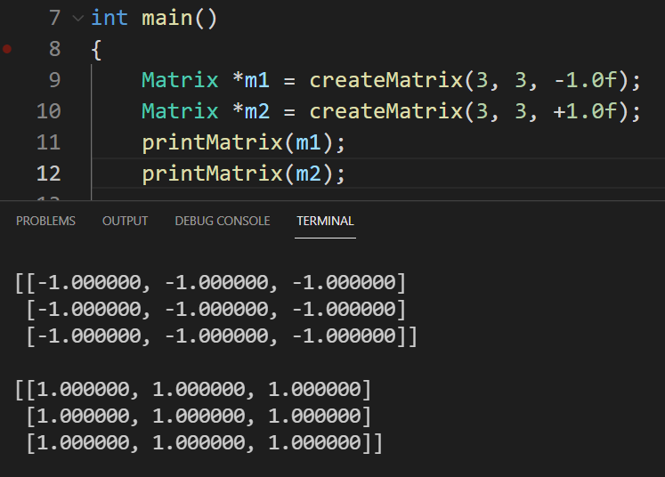

# Exercise

Create a matrix struct with the following properties

- float pointer to 1d heap array
- number of rows
- numer of cols

Implement the following functions for a **matrix** library:

```cpp
Matrix *createMatrix(const size_t num_rows, const size_t num_cols, const float value);

Matrix *freeMatrix(Matrix *matrix);

size_t matrixIndex(const size_t num_cols, const size_t i, const size_t j);

size_t matrixNumElements(const Matrix *const matrix);

bool matrixSameSize(const Matrix *const matrix1, const Matrix *const matrix2);

void printMatrix(const Matrix *matrix);
```

- createMatrix
  - The matrix (which has 2d indices (i, j)) should be stored as a 1D array on the heap
- freeMatrix
  - Free the allocated heap memory
- matrixIndex
  - Return the 1D-array index for the index (i, j)
  - Note: I talked about this use-case in the main course
- matrixNumElements
  - Return the number of elements of the array
- matrixSameSize
  - Return true if two arrays have the same sizes
- printMatrix
  - Pretty print the matrix elements to the console, example below:



Hint:
You can use the **vector** library as a starting point!

## Main Function

```cpp
#include <stdio.h>
#include <stdlib.h>

#include "Matrix.h"
#include "Vector.h"

int main()
{
    Matrix *m1 = createMatrix(3, 3, -1.0f);
    Matrix *m2 = createMatrix(3, 3, +1.0f);
    printMatrix(m1);
    printMatrix(m2);

    freeMatrix(m1);
    freeMatrix(m2);

    return 0;
}
```
