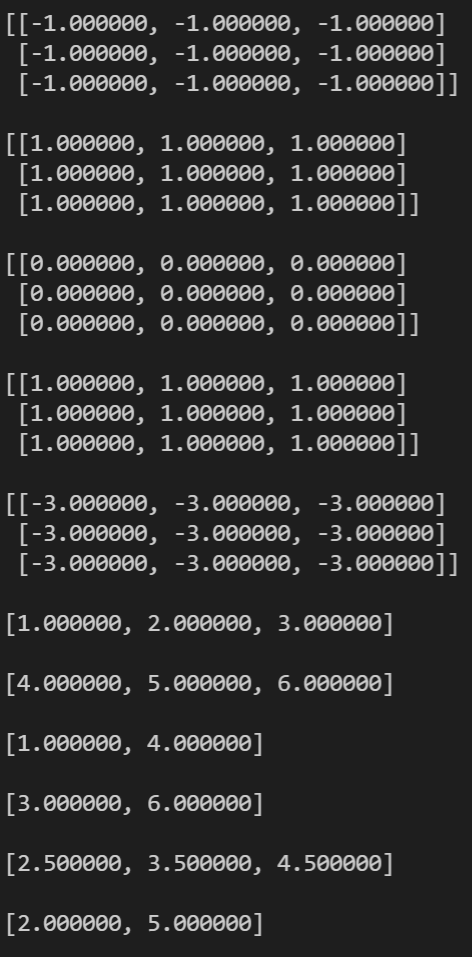

# Exercise

Implement the following functions for a **matrix** library:

```cpp
typedef enum
{
    AXIS_0,
    AXIS_1,
} Axis;

Vector *minMatrix(const Matrix *matrix, const Axis axis);

Vector *maxMatrix(const Matrix *matrix, const Axis axis);

Vector *meanMatrix(const Matrix *matrix, const Axis axis);
```

- minMatrix
  - Get the minimum of either the rows or columns
  - The axis parameter indicates if you have to compute it for the rows or columns
  - E.g. M = min([[1, 2], [3, 4]]), axis = 0 => [1, 2]
  - E.g. M = min([[1, 2], [3, 4]]), axis = 1 => [1, 3]
- maxMatrix
  - Get the maximum of either the rows or columns
  - The axis parameter indicates if you have to compute it for the rows or columns
  - E.g. M = max([[1, 2], [3, 4]]), axis = 0 => [3, 4]
  - E.g. M = max([[1, 2], [3, 4]]), axis = 1 => [2, 4]
- meanMatrix
  - Get the mean of either the rows or columns
  - The axis parameter indicates if you have to compute it for the rows or columns
  - E.g. M = max([[1, 2], [3, 4]]), axis = 0 => [2, 3]
  - E.g. M = max([[1, 2], [3, 4]]), axis = 1 => [1.5, 3.5]

Hint:
You can use the **vector** library as a starting point!

## Main Function

```cpp
#include <stdio.h>
#include <stdlib.h>

#include "Matrix.h"
#include "Vector.h"

int main()
{
    Matrix *m1 = createMatrix(3, 3, -1.0f);
    Matrix *m2 = createMatrix(3, 3, +1.0f);
    printMatrix(m1);
    printMatrix(m2);

    Matrix *m3 = addMatrix(m1, m2);
    Matrix *m4 = subMatrix(m3, m1);
    printMatrix(m3);
    printMatrix(m4);

    Matrix *m5 = multiplyMatrix(m1, m2);
    printMatrix(m5);

    Matrix *m6 = createMatrix(2, 3, 0.0f);
    m6->data[0] = 1;
    m6->data[1] = 2;
    m6->data[2] = 3;
    m6->data[3] = 4;
    m6->data[4] = 5;
    m6->data[5] = 6;

    Vector *min_axis0 = minMatrix(m6, AXIS_0);
    Vector *max_axis0 = maxMatrix(m6, AXIS_0);
    printVector(min_axis0);
    printVector(max_axis0);

    Vector *min_axis1 = minMatrix(m6, AXIS_1);
    Vector *max_axis1 = maxMatrix(m6, AXIS_1);
    printVector(min_axis1);
    printVector(max_axis1);

    Vector *mean_axis0 = meanMatrix(m6, AXIS_0);
    Vector *mean_axis1 = meanMatrix(m6, AXIS_1);
    printVector(mean_axis0);
    printVector(mean_axis1);

    freeMatrix(m1);
    freeMatrix(m2);
    freeMatrix(m3);
    freeMatrix(m4);
    freeMatrix(m5);
    freeMatrix(m6);

    freeVector(min_axis0);
    freeVector(max_axis0);
    freeVector(mean_axis0);
    freeVector(mean_axis1);

    return 0;
}
```

## Expected Console Output


